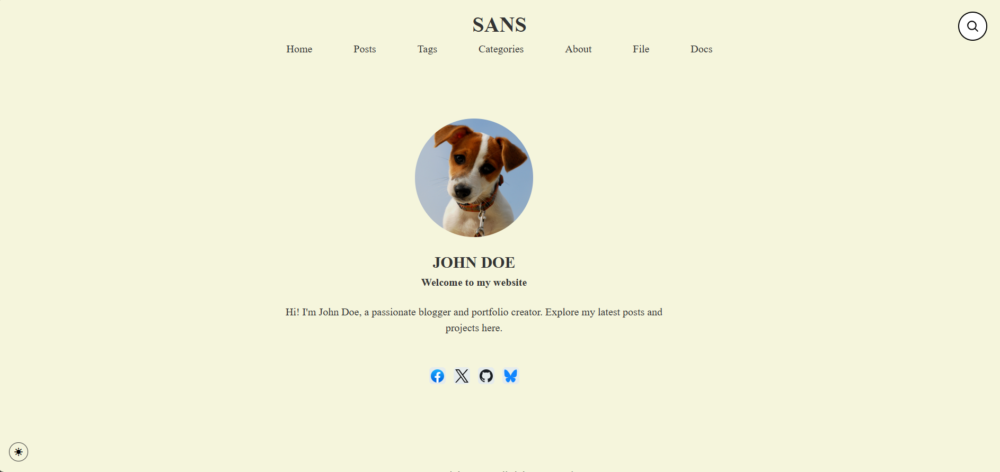

# Sans Hugo Theme

A minimal, responsive, and accessible Hugo theme built for blogs and personal sites.



## 🧩 Features
- Minimal, clean design
- Responsive layout
- Dark/light mode toggle
- Taxonomy cloud sidebar
- Disqus comments integration
- Syntax highlighting

## 🚀 Demo
👉 [Live Demo](https://sans-theme.vercel.app/)

## 📦 Installation
Clone into your Hugo site’s `themes` directory:

```bash
git submodule add https://github.com/yourname/sans.git themes/sans
